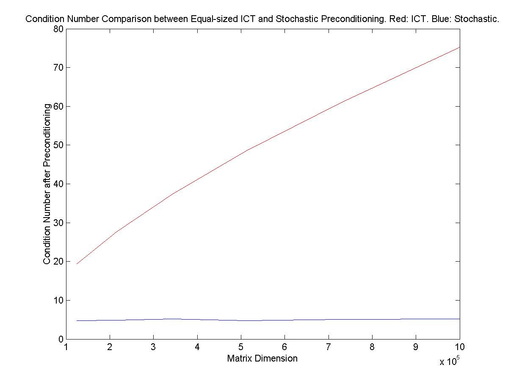

# Stochastic Preconditioning

This is a linear equation solver package for solving large sparse matrices.
It implements a preconditioning approach that uses random walks to build an incomplete factorization of a large sparse matrix, and contains reference implementations of the following papers.

- "[Stochastic preconditioning for diagonally dominant matrices](http://people.ece.umn.edu/users/sachin/jnl/sisc08.pdf)," Haifeng Qian and Sachin S. Sapatnekar, *SIAM Journal on Scientific Computing*, vol. 30, no. 3, pp. 1178-1204, 2008. 
- "[A hybrid linear equation solver and its application in quadratic placement](http://people.ece.umn.edu/users/sachin/conf/iccad05hq.pdf)," Haifeng Qian and Sachin S. Sapatnekar, *IEEE/ACM International Conference on Computer Aided Design Digest of Technical Papers*, pp. 905-909, 2005. 
- "[Random walks in a supply network](http://people.ece.umn.edu/users/sachin/conf/dac03.pdf)," Haifeng Qian, Sani R. Nassif and Sachin S. Sapatnekar, *Proceedings of the ACM/IEEE Design Automation Conference*, pp. 93-98, 2003. 

## Installation

Clone this repo and call `gmake` from inside the `src` directory.
A library file `libhybrid_solver.a` will be compiled.
APIs are in `src/HybridSolver.h` and are documented within.

Tested with g++ 11.4.0. Example 4 tested with MATLAB 6.1. Please open an issue in case of any problems.

## Examples

### Example 1

Demonstration of the most common usage of the APIs on a small matrix and two right-hand-side vectors.
Call `gmake` from inside the `examples/example1` directory.
An executable `testing` will be compiled.
Call `testing`.

### Example 2

Demonstration of the stochastic solver in the [2003 DAC paper](http://people.ece.umn.edu/users/sachin/conf/dac03.pdf) (see paper list above) on a small matrix, including its unique feature of solving a single entry in the solution vector without needing to solve the whole system.
Call `gmake` from inside the `examples/example2` directory.
An executable `testing` will be compiled.
Call `testing`.

### Example 3

Latency tests on three matrices with different sizes.
Call `gmake` from inside the `examples/example3` directory.
An executable `testing` will be compiled.
Call `testing`.
The following table shows latency numbers on a moderate laptop.

| dimension | number of non-zero | preconditioning time (sec) | solving time (sec) |
| -------- | ------- | ------- | ------- |
| 1000   | 6400   | 0.016 | 0     |
| 25000  | 168000 | 0.38  | 0.031 |
| 100000 | 676000 | 2.45  | 0.23  |

### Example 4

Condition number comparison against ICT (threshold based incomplete cholesky factorization) preconditioning.
This reproduces Figure 7.1 in the [2008 SISC paper](http://people.ece.umn.edu/users/sachin/jnl/sisc08.pdf) (see paper list above), and it demonstrates how one can retrieve the preconditioner matrices for advanced users.
Call `gmake` from inside the `examples/example4` directory.
Two executables `generate` and `precondition` will be compiled.
Open MATLAB, call either `run.m` or `run_small_set.m`.
The script `run_small_set.m` takes a few minutes to finish.
The script `run.m` takes hours to finish and the outcome will be the following plot.

## License

This project is licensed under the Apache-2.0 License.

